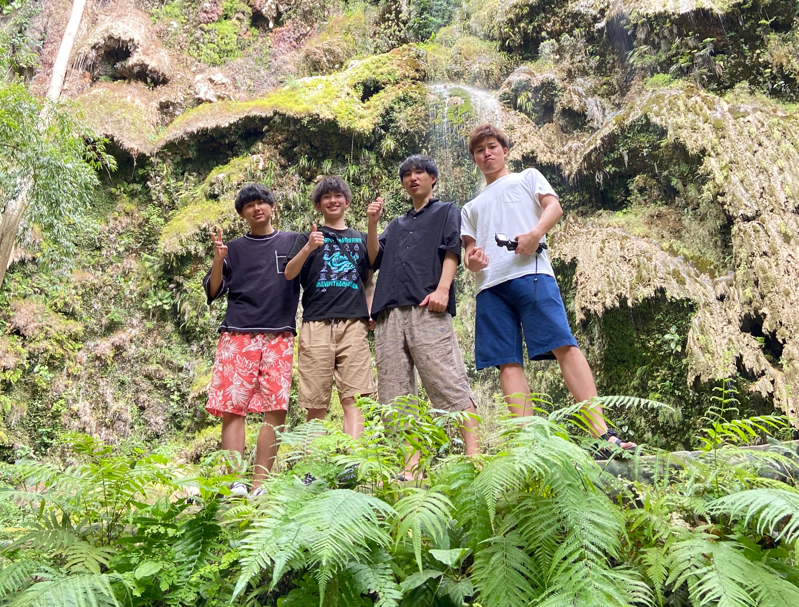
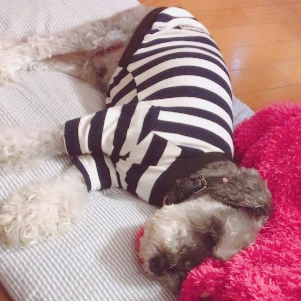
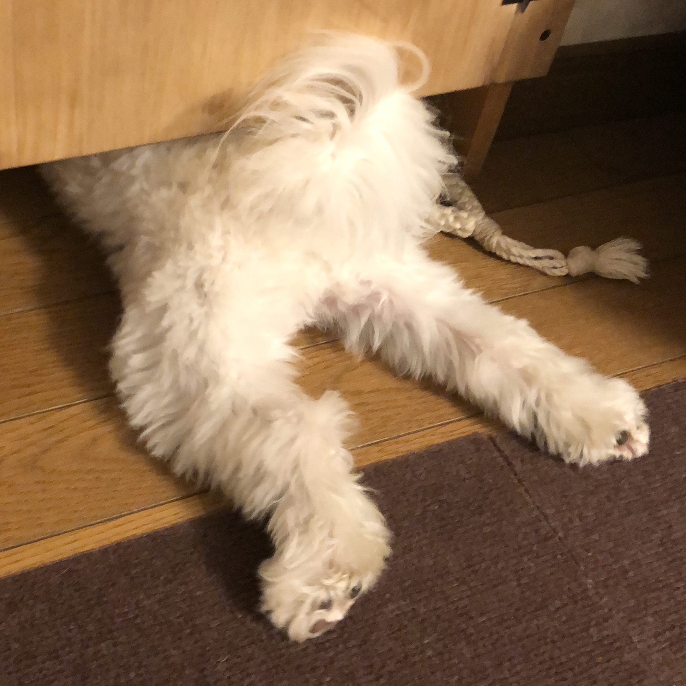
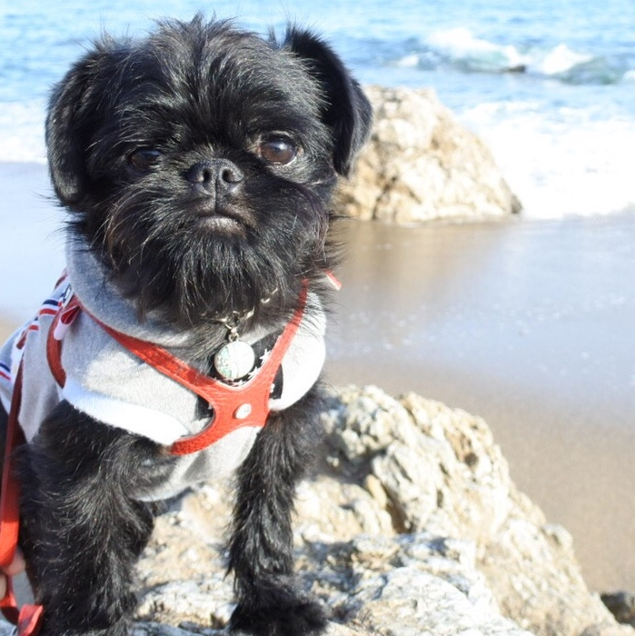

<!DOCTYPE html>
<html lang="ja">
<head>
    <meta charset="UTF-8">
    <meta name="viewport" content="width=device-width, initial-scale=1.0">
    <title>yuta's profile</title>
    <meta name="description" content="菅沼雄太のプロフィール兼ポートフォリオ">
    <link rel="stylesheet" href="portfolio.css">
    
    <link href="https://fonts.googleapis.com/css?family=Lato:400,700|Noto+Sans+JP:400,700" rel="stylesheet">
    <link href="https://fonts.googleapis.com/css?family=Lato:400,700|Noto+Sans+JP:400,700" rel="stylesheet">

</head>
<body>
    
    <header class="header">
        

            
-Web designer-

            <h1>SuganumaYuta</h1>
        

        <ul class="header-right">
            <li class="header-right-item"><a  href="#top">Top トップ</a></li>
            <li class="header-right-item"><a  href="#profile">Profile プロフィール</a></li>
            <li class="header-right-item"><a  href="#works">Portfolio ポートフォリオ</a></li>
            <li class="header-right-item"><a  href="#contact">Contact コンタクト</a></li>
        </ul>
    </header>

    <section id="top">
        

            
-Web designer-

            <h1>Suganuma Yuta</h1>
        

    </section>

    <section id="profile">
        

            

                <h3>Profile</h3>
                
はじめまして。こちらのページをご覧いただきありがとうございます。  
                    今現在、大学生の菅沼雄太と申します。 
                    愛知県出身で愛知県の大学に通っています。 
                    高校までは毎日サッカーの生活を送り、今は学業に励みながら趣味の音楽を聞くことと、旅行を楽しむ生活をしています。  
                    Web制作歴はまだ浅いですが、精一杯より良いものを作りあげれたらいいなと考え、日々精進しています。  
                    SNS,メールアドレスを掲載しておくので、お仕事の相談でもお気軽にご連絡いただければと思います。
                

            

             
        

        

            

                <h3>Skill</h3>
                
HTML&CSS、Javascript、jQueryをメインにWebコーティングを行っていきたいと考えております。  
                    ポートフォリオとして、このページを作りました。レスポンシブ方式で作っています。まだ依頼を請負った経験はないので、至らない部分があると思いますが、その分報酬は低くさせていただいてます。
                    ご依頼者様のご希望通りの高品質なものを作りあげれるよう尽力を尽くします。  
                    このページの下には実績を載せようと思っていますが、まだ実績を持っていないので愛犬を載せておきます。

            

            
        

    </section>

    <section id="works">
        <h3>Works</h3>
        <ul class="works-items">
            <li class="works-item-box">
                <a class="works-item" href="portfolio-work-1.html">
                    
                    

                        <h4>BB</h4>
                        
昨年亡くなってしまった、ぼくの相棒です。たくさんのものをくれました。

                    
    
                </a>
            </li>
            <li class="works-item-box">
                <a class="works-item" href="portfolio-work-1.html">
                    
                    

                        <h4>リアン</h4>
                        
今家にいるペットたちのお母さん的存在です

                    
    
                </a>
            </li>
            <li class="works-item-box">
                <a class="works-item" href="portfolio-work-1.html">
                    
                    

                        <h4>JJ</h4>
                        
とても頭の良いがきんちょです。

                    
    
                </a>
            </li>
            <li class="works-item-box">
                <a class="works-item" href="portfolio-work-1.html">
                    
                    

                        <h4>ライアン・ネロ</h4>
                        
まだ一歳になってないpuppyです。

                    
    
                </a>
            </li>  
        </ul>    
    </section>

    <section id="contact">
        <h3>Contact</h3>
        <form action="mailto:bmto0108@yahoo.co.jp" method="post" enctype="text/plain">
            <dl class="contact">
                <dt class="contact-dt">NAME</dt>
                <dd class="contact-dd"><input type="text" name="name"></dd>
                <dt class="contact-dt">E-MAIL</dt>
                <dd class="contact-dd"><input type="email" name="email"></dd>
                <dt class="contact-dt">MESSAGE</dt>
                <dd class="contact-dd"><textarea name="question" id="" cols="30" rows="10"></textarea></dd>
            </dl>
            <input class="btn" type="submit" value="送信">
        </form>
    </section>

    <footer>
        

           
            

              
              
            

            <small class="copyright">©Suganuma Yuta
            </small>
          

    </footer>   

</body>
</html>
